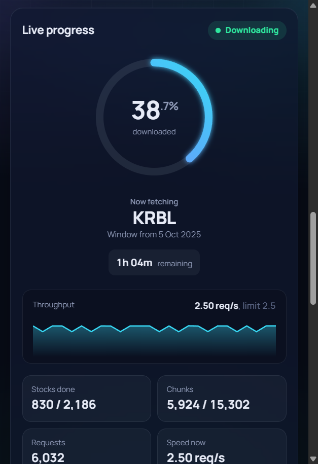

# Zerodha Historical API

A local Flask app that signs in to Zerodha Kite Connect and downloads historical candles (1-minute or daily) for every NSE equity stock (about 2,200 symbols, up to one year per run) and for the main NSE indices such as the NIFTY 50 spot (up to 20 years per run, for example from 2015). Files are saved as CSV or Parquet, downloads can be stopped and resumed, and the dashboard shows live progress.


## Requirements
- Python 3.10 or newer
- A Kite Connect app (the paid Kite Connect plan, Rs 500/month, which includes historical data). If Kite rejects the requests, the error appears in the dashboard.
- An internet connection (the dashboard loads React and fonts from public CDNs)

## Setup
1. Install the dependencies and start the app:
   ```
   pip install -r requirements.txt
   python app.py
   ```
2. In the Kite developer console, set your app's redirect URL to exactly:
   ```
   http://127.0.0.1:5000/callback
   ```
3. Open http://127.0.0.1:5000, enter your API key and secret, and sign in with Zerodha.

   

Kite sessions expire every day, so you need to sign in again each day.

## Downloading data
1. Under **Stocks**, tick any of: **NSE equity stocks**, **NIFTY 50 spot**, **NIFTY BANK**, **NIFTY FIN SERVICE**, **NIFTY MID SELECT** and **INDIA VIX**. At least one is needed. With equity ticked, you can also include trade-to-trade stocks (`-BE`, `-BZ`) and ETFs (both off by default).
2. Choose the candle size: **1 minute** or **Daily (EOD)**.
3. Pick a date range, or use a shortcut (last 30 days, 3 months, 6 months or 1 year, or **Since 2015** when only indices are ticked). With equity ticked the range can be one year at most. With only indices ticked it can be up to 20 years.
4. Set the speed, from 0.5 to 3 requests a second (Kite's limit is 3). The app slows down automatically if Kite rate-limits it.
5. Choose a save folder and a file format: **CSV** (opens in Excel) or **Parquet** (smaller, for pandas and Python). Indices use the same format as stocks. The hint under the folder shows the name of the folder the download will create (see [Output](#output)).
6. Click **Start download**.

Before you start, the dashboard estimates the number of requests and the time the download will take. Kite returns at most 60 days of 1-minute candles per request, so a year of 1-minute data takes 7 requests per stock, about 15,000 in total, or roughly 1 h 45 min at full speed. Daily data takes one request per stock (Kite returns up to 2,000 days of daily candles per request).

### Indices (NIFTY 50 spot and others)
Indices are cheap: NIFTY 50 from 2015 to today is 3 requests for daily candles and about 72 for 1-minute candles, so it finishes in under a minute. If you tick indices and equity together, one job fetches the indices first, then the stocks. For daily and 1-minute data, run the download twice, once per candle size. Kite's 1-minute index data starts around 9 January 2015, so earlier windows come back empty and are counted as **Empty chunks**, not failures. Index candles have a volume of 0. The NIFTY 50 spot is instrument token `256265` (`NSE:NIFTY 50`).

### Live progress
While a download runs, the dashboard shows the percentage done, the part being fetched (for example "Indices: NIFTY 50", then "Equity: 1,240 / 2,942 stocks"), the symbol, the time left, the request speed, rate-limit hits and errors, the folders being written to, and a list of the stocks and indices completed so far. The browser tab title also shows the percentage.



### Stopping and resuming
Progress is saved after every request. Click **Stop download** at any time. To continue, start again with the same selection, dates, file format and save folder, and click **Resume download**. Finished chunks are skipped, and the files keep going into the folder the download started in. Requests that fail are retried automatically at the end of the run.

## Output
Each download gets its own folder, named after what was downloaded, the candle size (`1min` or `EOD`), the selected date range and the time the download started:
```
<folder>/<Equity_stocks|Index_spot>_<1min|EOD>_<from>_to_<to>_started_<date>_<HHMM>/<SYMBOL>/<year>.csv   (or .parquet)
```
For example:
```
D:\market_data\Equity_stocks_1min_2025-10-05_to_2026-10-04_started_2026-10-04_1530\RELIANCE\2026.csv
D:\market_data\Index_spot_EOD_2015-01-01_to_2026-10-04_started_2026-10-04_1530\NIFTY_50\2015.csv
```
A job with both indices and equity ticked writes two folders. Resuming a download keeps writing into the folder it started in. Spaces in index names become underscores in the folder name (`NIFTY_50`), but the `tradingsymbol` column keeps the real name (`NIFTY 50`). Indices use the same file format setting as stocks. Each file has the columns `date, open, high, low, close, volume, tradingsymbol, instrument_token`. Times are in IST. Index candles have a volume of 0.

The progress database (`progress.sqlite`) and the error log (`errors.log`) are kept directly in the save folder, next to the download folders. They record which folder each download uses, so to resume a download, choose the same save folder.

Data downloaded with older versions of the app is in `<folder>/minute/` and `<folder>/day/` and is left as it is.

## Which stocks are included
Every NSE equity (`EQ`) instrument with no series suffix, plus `-BE` and `-BZ` trade-to-trade stocks if you include them. Bonds, NCDs, government securities, T-bills, sovereign gold bonds and SME stocks are excluded, and ETFs are excluded unless you include them. The dashboard shows the exact counts once the download starts.

## Credentials
Your API key, secret and access token are stored only in a local `.env` file, which the app creates when you sign in. It is gitignored and never committed. `.env.example` shows the format.

Screenshots show demo data, not a real account.

## Development notes
Architecture and implementation notes are in [CLAUDE.md](CLAUDE.md).
