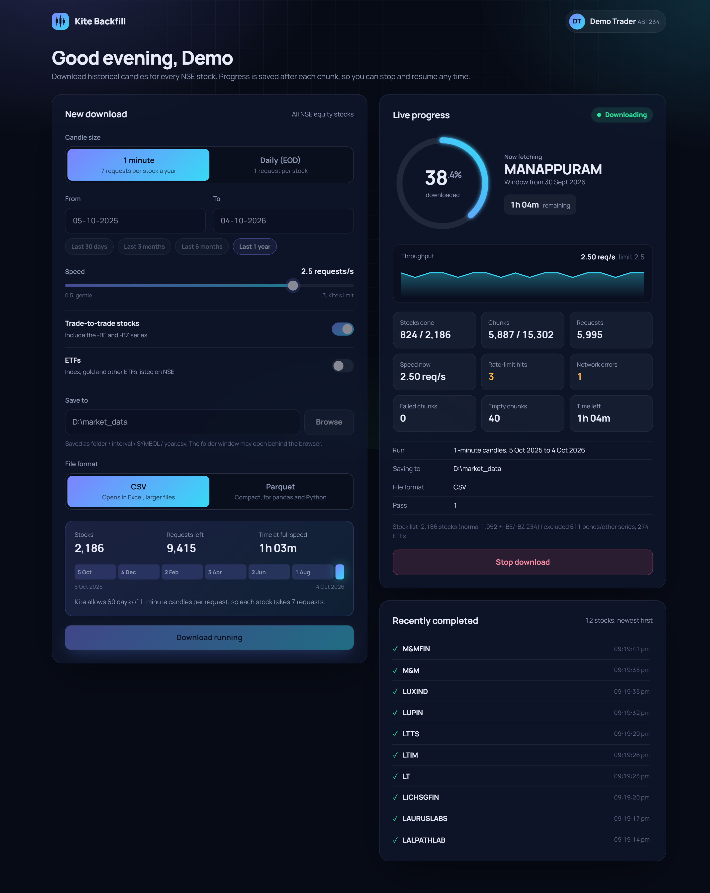
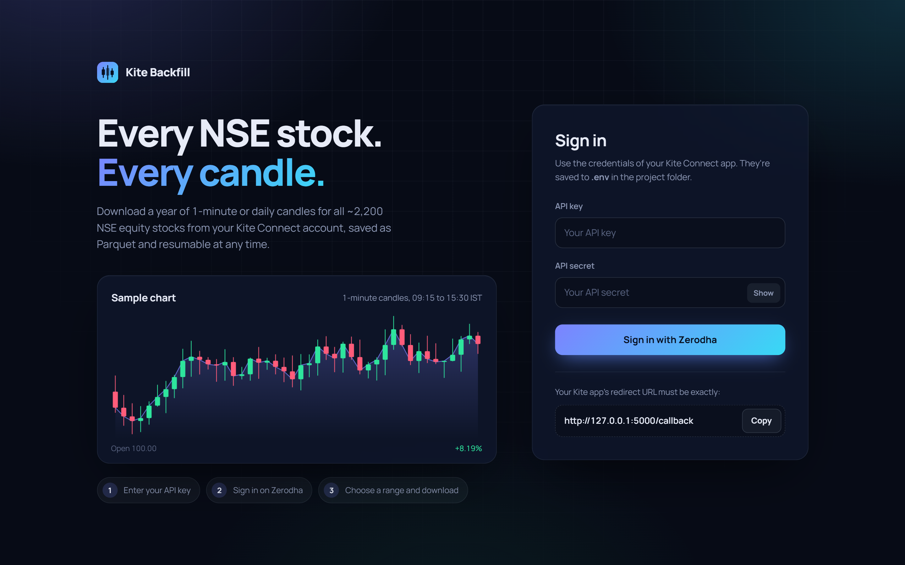

# Zerodha Historical API

A local Flask app that signs in to Zerodha Kite Connect and downloads historical candles (1-minute or daily) for every NSE equity stock, about 2,200 symbols, up to one year per run. Files are saved as CSV or Parquet, downloads are resumable, and the dashboard shows live progress.



## Requirements
- Python 3.10+
- A Kite Connect app with the paid **Historical data** add-on

## Setup
```
pip install -r requirements.txt
python app.py
```
Open http://127.0.0.1:5000, enter your API key and secret, and sign in with Zerodha.



In the Kite developer console, set your app's redirect URL to exactly:
```
http://127.0.0.1:5000/callback
```

## Using it
1. Choose 1-minute or daily candles, a date range (one year at most), the request speed, a save folder, and CSV or Parquet.
2. Click **Start download**. Progress is saved after every chunk, so you can stop at any time and click **Resume download** later with the same dates and folder.
3. Watch progress in **Live progress**: the stock being fetched, time left, request speed, errors, and a list of completed stocks.

Files are saved as `<folder>/<interval>/<SYMBOL>/<year>.<csv|parquet>`.

Kite sessions expire every day, so you need to sign in again each day.

## Credentials
Your API key, secret and access token are stored only in a local `.env` file, which is gitignored and never committed. `.env.example` shows the format.

Screenshots show demo data, not a real account.

Architecture notes are in [CLAUDE.md](CLAUDE.md).
